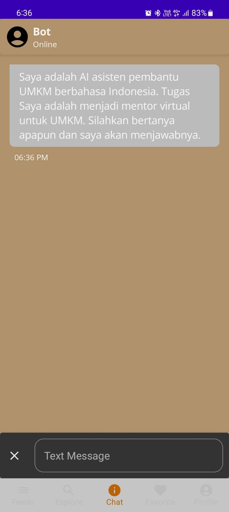
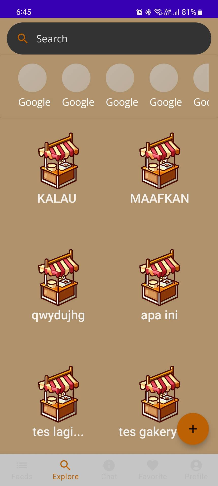
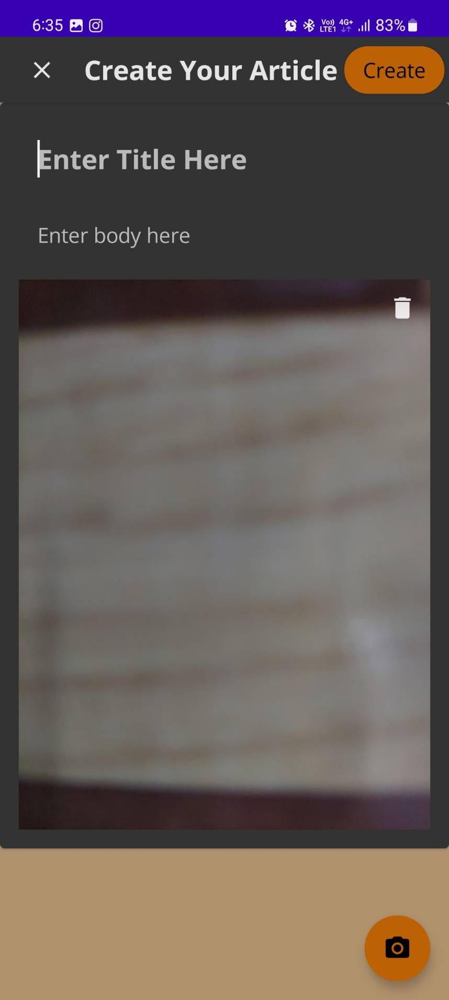
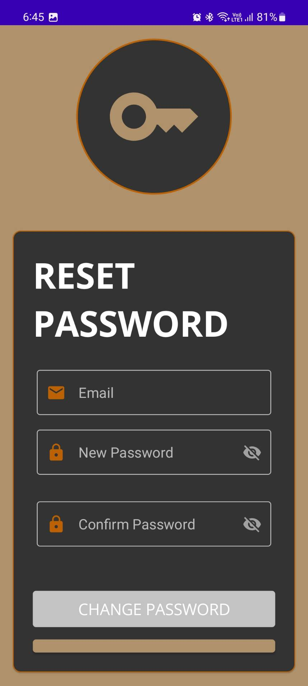

# Kawan-Usaha-App

### Android App Kawan Usaha
This is Repository for Kawan-Usaha-App made by team MD on this group.
Documentation [here](./app/gfm/index.md)

## Initial Step to Make Kawan-Usaha-App
Our beginning step to make Kawan-Usaha-App is making the raw layout on sheets to know the general view for our layout. Initially, our plan was to design a single-screen layout with multiple features. However, upon careful consideration, we decided to divide the features into separate screens as we realized that having all the features in one screen would result in an overwhelming and cluttered interface.

## First Step to Make Kawan-Usaha-App
First thing first before we make the layout on android studio, we make the framework design/mock design on figma. We make sure what layout design, the color, placement of the feature, font style, how many pages are needed, and the flow of the app. Here’s our design result on figma

## Implement to Android Studio Project
After making the framework design in figma finish, next we move to implement all the framework to the android studio. We use jetpack Compose as our main toolkit to make an interface for our application. The reason we use jetpack Compose is because we feel that building ui is easier rather than using traditional XML. We first make the ui for the entire screen, like login, register, main screen and etc based on design we've made on figma. After that, we implement business logic to connect app to API that made by Cloud Computing team, including LLM for chat bot from ML team. To get LLM data response, we implement on streaming the response by each words and display it on chat layout screen we made before.

## Connecting Android Studio Project to Github Organization Project.
The next step is connecting our Android Studio Project to the Github Organization Project we made before. With this, it’s easier for us to communicate, work together, and storing data between backend to front end.

## Library on Kawan-Usaha-App
Here’s some library we use to make this app working

**Retrofit**

With Retrofit we can provide a convenient and efficient way to interact with RESTful APIs from the backend.

```
implementation 'com.squareup.okhttp3:logging-interceptor:4.9.0'
implementation 'com.squareup.okhttp3:okhttp:4.10.0'
implementation "com.squareup.retrofit2:converter-gson:$retrofit_version"
implementation "com.squareup.retrofit2:retrofit:$retrofit_version"
implementation 'com.google.code.gson:gson:2.9.0'
implementation "com.squareup.okhttp3:okhttp-sse:4.9.3"
```

**Material 3**

Use for implement search bar on explore and some icons extended that not have on default compose

```
implementation "androidx.compose.material3:material3:1.1.0"
implementation "androidx.compose.material3:material3-window-size-class:1.1.0"
implementation "androidx.compose.material:material-icons-extended:1.4.3"
```

**CameraX**

Use for implement search bar on explore and some icons extended that not have on default compose

```
def camerax_version = "1.0.1"
implementation "androidx.camera:camera-camera2:1.2.3"
implementation "androidx.camera:camera-lifecycle:1.2.3"
implementation "androidx.camera:camera-view:1.3.0-alpha07"
```

**Firebase**

Use for login using google account, so user have a different choice to login.

```
implementation 'com.google.android.gms:play-services-auth:20.5.0'
implementation 'com.google.firebase:firebase-auth-ktx:22.0.0'
```

**Dokka**

For documentation purpose in github

```
dokkaPlugin("org.jetbrains.dokka:android-documentation-plugin:1.8.10")
```

## Figma Design
Here's our framework API that we make on Figma Platform

  
  
  
  
  
  
  
  

### Images

#### Main Features
Chat with your AI mentor



Explore other articles



Recommended articles for you


View more details about an article


Write your own articles




#### About You
Login to make this more personal


Create a new account


Reset your password



Your profile details


Edit your profile


